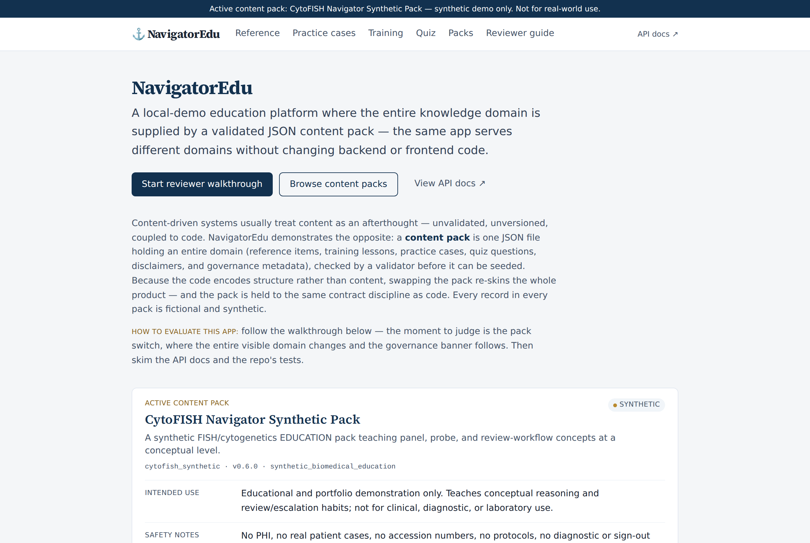
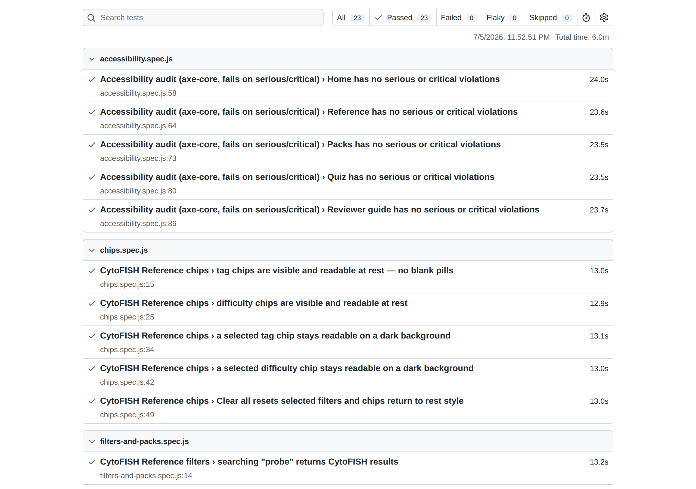

# NavigatorEdu ⚓


**A full-stack learning platform where the entire knowledge domain is a
swappable, validated JSON content pack.** One codebase (FastAPI + SQLite +
vanilla-JS SPA) hosts three complete demo domains — including a fully
synthetic cytogenetics/FISH education pack — switched by a single environment
variable, with governance metadata and content validation enforced in CI.

> **Synthetic-content statement:** every record in this application is
> fictional, written for this demo. There are no real organizations, people,
> patients, cases, or operational procedures here, and nothing is suitable for
> real-world, operational, or clinical use. That statement is enforced by the
> system itself: each pack must declare `synthetic_only: true` in governance
> metadata that the validator checks on every CI run.

## What this is, in 30 seconds

- **What:** a reference-library / training-module / practice-case / quiz web
  app whose content is entirely data — a JSON "content pack" loaded into
  SQLite by an idempotent seed script. One FastAPI + SQLite + vanilla-JS
  codebase; three complete demo domains.
- **The problem it demonstrates:** content-driven systems usually treat
  content as an afterthought — unvalidated, unversioned, coupled to code.
  Here the content is held to a governed, CI-enforced contract while the
  code encodes only structure.
- **Why the content-pack architecture matters:** identifying the invariant
  structure beneath a domain and keeping it out of the code is the
  load-bearing idea behind LMS platforms, white-label products, and
  documentation systems. This repo makes it concrete: switching packs
  re-skins every page of the product with zero code changes.
- **What to click first:** run the app and open **Reviewer guide** in the
  top navigation (`#/guide`) — an in-app 3–5 minute walkthrough. Not running
  anything? [docs/REVIEWER_GUIDE.md](docs/REVIEWER_GUIDE.md) is the same
  guide, readable right here on GitHub.



## Reviewer quick path

The whole evaluation, in order — 2–3 minutes in the running app:

1. **Start at the [Reviewer guide](docs/REVIEWER_GUIDE.md)** (`#/guide` in
   the app) — what the app is, what to try, what to notice, and the safety
   boundaries, with one-click jumps into every section.
2. **Try Reference search and filtering** — type a partial word (FTS5 prefix
   matching), then narrow with tag and difficulty chips; filtering is
   server-side.
3. **Open a Practice case** — guided steps reveal one at a time; answer
   material is deliberately absent from list endpoints.
4. **Take the Quiz and download the report** — scoring is server-side
   (correct answers never appear in the page source), and the report is a
   self-contained printable HTML file generated statelessly.
5. **Switch content packs** on the Packs page — one click reseeds the demo
   database and the entire visible domain changes. This is the moment the
   architecture proves itself.
6. **Open the API docs** at `/docs` — the frontend is just one consumer of
   the same versioned API.
7. **Read the [Case Study](docs/PORTFOLIO_CASE_STUDY.md) and
   [Retrospective](docs/RETROSPECTIVE.md)** — why it was built this way, and
   the debugging stories behind it.

## Technical proof, at a glance

Every row is enforced by CI on every push — the badge above is the live
status across all three jobs (`test`, `docker-build`, `browser-test`):

| Proof | Where it lives |
|-------|----------------|
| **137 pytest tests, no mocks** | `tests/` — isolated in-memory DBs through one dependency-injection seam |
| **25 Playwright browser tests** | `tests/browser/` — computed-style chip assertions, search/filter behavior, pack switching, report download verified file-in-hand |
| **Accessibility audit in CI** | axe-core, full default ruleset, five views; serious/critical violations fail the build |
| **Keyboard-only journeys** | five tests completing the main tasks with real Tab/Enter/Space events — no mouse, no programmatic focus |
| **Content validated like code** | `validate_pack` gates all three packs — structure, references, quiz sanity, governance metadata |
| **Docker build** | non-root image built and smoke-tested in CI on every push |
| **Deployment option** | [`render.yaml`](render.yaml) blueprint — deploy a fork from the browser, no CLI |

And the boundary, stated as often as it is enforced: **all content is
synthetic; nothing here is suitable for real-world, operational, or
clinical use.**

## Portfolio value

This project is built to be read by employers. It maps to real work in:

- **Clinical laboratory informatics** — the CytoFISH pack shows a
  specialized, safety-sensitive domain (cytogenetics/FISH education concepts)
  hosted on a generic platform, with every safety boundary carried in the
  content and its governance metadata rather than bolted onto code. This is a
  demonstration of domain interest and safe-data discipline, not a clinical
  tool or a claim of clinical validity.
- **Structured educational content systems** — categories, reference items,
  ordered training modules, guided practice cases, and server-scored quizzes
  over one relational model; the shape of an LMS or documentation platform in
  miniature.
- **Validation and governance** — a CLI validator enforces the pack contract
  (structure, references, quiz sanity, and required provenance/intended-use
  metadata) and runs in CI, so a content edit that breaks the contract fails
  the build exactly like a code regression.
- **Data-backed UI/API workflows** — versioned REST endpoints with deliberate
  list/detail response shaping; the frontend and Swagger docs both consume
  the same API.
- **Test-driven development** — 137 pytest tests against isolated in-memory
  databases through one dependency-injection seam; real queries, zero mocks.
- **Content-pack architecture** — the load-bearing idea behind white-label
  products, LMS platforms, and documentation systems: identify the invariant
  structure beneath a domain and keep it out of the code.
- **Safe synthetic domain modeling** — inventing realistic-shaped but fully
  fictional content, stating its boundaries in disclaimers and metadata, and
  enforcing the synthetic-only invariant mechanically.

### Why the CytoFISH pack matters

CytoFISH Navigator is the strongest single artifact in the repo for a career
direction toward clinical laboratory informatics. It shows two things at
once: familiarity with the *shape* of cytogenetics/FISH education content
(panels, probes, signal-pattern reasoning, review and escalation habits), and
the judgment to model that domain **safely** — no PHI, no real cases, no
accession numbers, no protocols, no diagnostic language, with those
exclusions written into the pack's own disclaimers and `safety_notes`. In
regulated fields, knowing what to leave out is as important as knowing what
to include; this pack demonstrates that instinct without overclaiming any
clinical capability.

## Technical highlights

| Area | What's here |
|------|-------------|
| Backend | **FastAPI**, versioned `/api/v1` routers, dependency-injected sessions |
| Data | **SQLModel / SQLite**; six related tables; JSON columns for list fields; **FTS5 full-text search** over reference items, rebuilt on every seed |
| Testing | **Pytest** — 137 tests on isolated in-memory DBs via one DI override; no mocks |
| CI | **GitHub Actions** — pytest + pack validation, Docker build check, and Playwright browser tests including an **axe-core accessibility audit** (fails on serious/critical), on every push/PR |
| Ops | **Docker** (non-root image, PORT-aware) + compose volume and healthcheck; **Render blueprint** for deploy-it-yourself hosting |
| Content pipeline | **Content-pack validator** (`validate_pack`) gating CI; **SEED_PATH**-based pack switching; **authoring command** (`new_pack`) scaffolding valid, safe-by-default packs |
| Governance | **Pack-metadata endpoint** (`GET /api/v1/pack-metadata`) reporting exactly what was seeded; active pack shown in the UI banner |
| Pack browser | **Allowlisted local-demo selector** (`/api/v1/packs` + Packs page) — flip between the bundled domains from the UI; no paths, no uploads |
| Learning reports | **Stateless exportable reports** (`POST /api/v1/quiz/report`) — printable, self-contained HTML per quiz attempt; no accounts, nothing persisted |
| Frontend | Single-file vanilla-JS SPA (Tailwind via CDN, hash router, HTML-escaped markdown rendering) — a deliberate no-build-step demo UI |
| Domains | Three validated packs: Tidewatch Guild (celestial navigation), ArchiveGuild (archive apprenticeship), **CytoFISH Navigator** (synthetic cytogenetics/FISH education) |

## Run it locally

```bash
python -m venv .venv && source .venv/bin/activate   # Windows: .venv\Scripts\activate
pip install -r requirements.txt
python -m backend.app.seed        # builds data/navigatoredu.db from seed.json
uvicorn backend.app.main:app --reload
```

- App: <http://127.0.0.1:8000>
- API docs: <http://127.0.0.1:8000/docs>

First run auto-seeds an empty database; the explicit seed script is for
re-importing after editing a pack, and for switching packs (seeding
clears the content tables first, then loads only the selected pack).

Or with Docker:

```bash
docker compose up --build
```

## Live demo / deployment

**Local run is the primary demo path** — this project is built to be cloned
and running in under a minute. For reviewers who want a hosted look, the
repo includes a one-file deployment blueprint for **Render** (chosen for
simplicity: free tier, deploys from a GitHub fork in the browser, no CLI,
no payment method, and it consumes the existing Dockerfile unchanged).

Deploy it yourself:

1. Fork this repository.
2. In the Render dashboard: **New → Blueprint**, select your fork. Render
   reads [`render.yaml`](render.yaml) and builds the Dockerfile.
3. Optionally set the `SEED_PATH` environment variable to choose which
   bundled pack the instance serves:

   | Pack | `SEED_PATH` value |
   |------|-------------------|
   | Tidewatch Guild (default) | `data/seed.json` |
   | ArchiveGuild | `data/seed_archiveguild.json` |
   | CytoFISH (synthetic) | `data/seed_cytofish_synthetic.json` |

Scope and safety, stated plainly: a deployed instance serves **only the
bundled synthetic packs** — the allowlisted selector cannot load anything
else, there are no uploads and no user data, and all content remains
fictional. **No real clinical use, no PHI, no real patient data**, on the
server exactly as locally. There is deliberately no auth (nothing to
protect), no persistence beyond the demo SQLite file (free-tier disks are
ephemeral; the app re-seeds `SEED_PATH` on every start, so UI pack switches
last until the next restart — expected demo behavior), and **no continuous
deployment** (CI includes a Docker *build check* only; `autoDeploy` is off
in the blueprint).

## Demo the CytoFISH pack

Easiest way: open **Packs** in the running app and click **Load demo
pack** — a local-demo selector that reseeds from one of the three bundled,
allowlisted packs and refreshes the UI (no arbitrary paths, no uploads;
details in [docs/ARCHITECTURE.md](docs/ARCHITECTURE.md)).

The command-line workflow works unchanged, and is the canonical way outside
the browser. Switching is a single reseed — the seed script clears existing
content before loading, so the database always holds exactly one pack:

```bash
SEED_PATH=data/seed_cytofish_synthetic.json python -m backend.app.seed
SEED_PATH=data/seed_cytofish_synthetic.json uvicorn backend.app.main:app --reload
```

Open <http://127.0.0.1:8000> — the banner and home card name the active pack
and restate that it is synthetic-only. The raw governance metadata is at
`/api/v1/pack-metadata`. The other packs work the same way with their file in
`SEED_PATH` (`data/seed.json` is the default; `data/seed_archiveguild.json`
is the third domain).

## Validate all content packs

```bash
python -m backend.app.validate_pack data/seed.json
python -m backend.app.validate_pack data/seed_archiveguild.json
python -m backend.app.validate_pack data/seed_cytofish_synthetic.json
```

The validator checks structure, required fields, unique IDs, foreign
references, quiz-answer sanity, and the governance metadata (including the
`synthetic_only: true` invariant). It collects all problems before reporting
and exits 0/1/2 for valid/invalid/unreadable. CI runs it on every push.

## Create a new content pack

```bash
python -m backend.app.new_pack demo_pack        # → data/seed_demo_pack.json
python -m backend.app.new_pack demo_pack --force # regenerate (overwrite)
```

The scaffolder emits a minimal, fully-wired pack that passes the validator
immediately and ships safe-by-default (`synthetic_only: true`,
educational-demo-only intended use, safety notes forbidding real records,
real cases, and operational or clinical use). Edit the `TODO` placeholder
records, validate, seed, run. Full schema and workflow:
[docs/CONTENT_AUTHORING.md](docs/CONTENT_AUTHORING.md).

## 60-second demo script

The home page carries this walkthrough on-screen (hero → **Start reviewer
walkthrough**), with a "Notice:" line per step telling the reviewer what each
step proves. The canonical order:

1. **Home** — hero states what the app is; the active-pack manifest card
   shows the loaded domain's governance metadata (intended use, safety
   notes, synthetic-only badge), served by `GET /api/v1/pack-metadata`.
2. **Packs → Load a different pack** — one click reseeds the local demo
   database from an allowlisted bundled pack. The banner and manifest change
   immediately.
3. **Reference** — the entire domain has changed with zero code changes.
   This is the moment to judge: the content-pack architecture made visible.
   Search is FTS5-backed (try a partial word — prefix matching works), and
   tag/difficulty chips narrow results server-side.
4. **A practice case** — guided steps reveal one at a time; answer material
   is omitted from list endpoints and fetched on demand.
5. **Quiz → check answers** — scoring happens server-side; correct answers
   never appear in the page source before submission. Then **Download
   report**: a self-contained, printable HTML summary of the attempt,
   generated statelessly from the submitted answers — nothing is stored.
6. **`/docs`** — the same API, self-documenting via OpenAPI.
7. **Close on validation and CI** — every content pack is checked by
   `validate_pack` on every push: structure, references, quiz sanity, and
   required governance metadata. Content is held to the same contract
   discipline as code.

The home page also states what the project demonstrates, what is
intentionally out of scope (no clinical use, no PHI, no uploads, no
auth/AI), and the tech stack — so a reviewer gets positioning, safety
posture, and demo path without opening a single doc. Presenting live?
[docs/DEMO_GUIDE.md](docs/DEMO_GUIDE.md) has a 2-minute demo and a 5-minute
technical demo, plus CLI pack switching.

## Data model

| Table          | Purpose                              | Notable fields |
|----------------|--------------------------------------|----------------|
| Category       | Content taxonomy                     | `parent_id` (self-FK, nesting-ready) |
| ReferenceItem  | Core library entries                 | `tags` (JSON), `difficulty`, `disclaimer_id` |
| TrainingNote   | Ordered lessons grouped by module    | `related_item_ids` (JSON) |
| PracticeCase   | Scenario + guided steps + outcome    | answer fields hidden in list views |
| QuizQuestion   | MCQ with explanation                 | `correct_index` never serialized on GET |
| Disclaimer     | Safety/synthetic-content notices     | `applies_to` scope |
| PackMetadata   | Single-row record of the seeded pack | `synthetic_only`, `intended_use`, `safety_notes` |

## Tests

```bash
python -m pytest        # 137 tests
```

Tests run against an **isolated in-memory SQLite database** seeded from the
same pack format, injected by overriding the one `get_session` dependency —
real queries, zero mocks, and the development database is never touched.

### Browser tests (Playwright)

Pytest covers backend and data invariants; a separate **Playwright** suite
covers the UI-behavior layer a headless harness can't see — added because
the two bugs manual review caught (blank filter chips, stale categories
after pack switching) both lived in exactly that layer. Twelve tests cover
chip readability via real computed styles (at rest, selected, after Clear
all), search/tag/difficulty/combined filtering, pack switching through the
Packs UI with stale-content assertions, the quiz report download (file
contents verified, `<script>`-free), and an API-docs smoke. Five further
tests run the accessibility audit below (now including the Reviewer guide
page), five run the keyboard-only journeys, and three pin the Reviewer
guide's structure, CTA links, and keyboard operability — twenty-five
browser tests total.



### Keyboard-only journeys

Five tests (`tests/browser/keyboard.spec.js`) prove the app's main tasks
can be **completed without a mouse**, using only real keyboard events
(Tab / Shift+Tab / Enter / Space): reaching and activating every main nav
section; searching, filtering by tag and difficulty, and clearing filters
on Reference; loading a different content pack and confirming Reference
reflects it with no stale categories; answering the full quiz, checking
answers, and downloading the verified report; and a focus-visibility test
asserting keyboard focus produces a real outline (style-based invariant,
no exact-RGB assertions) that is absent at rest. Reachability is proven by
bounded tabbing — never programmatic `.focus()` — so a focus trap or an
unreachable control fails loudly with a description of where focus ended
up. They run as part of `npm run test:browser` and the same `browser-test`
CI job; no separate command.

### Accessibility (axe-core in CI)

Every CI run scans Home, Reference, Packs, Quiz, and the Reviewer guide in a real browser with
the **full default axe-core ruleset** (via `@axe-core/playwright`, a dev
dependency only — nothing ships to the app). **Serious and critical
violations fail the build**; minor/moderate findings are printed in the
test output as advisories rather than silently ignored. No rules are
disabled and no elements are excluded. Current status: all five scanned views come back
clean at every impact level. Muted text standardizes on `text-slate-600`
as its lightest tone (≥7:1 on every background in use), after the audit's
first CI run correctly failed lighter slate tones — details in
[ROADMAP](docs/ROADMAP.md) and [ARCHITECTURE](docs/ARCHITECTURE.md).

Honest limits of this posture, deliberately documented rather than implied
away: automated scanning covers only the mechanically checkable subset of
WCAG (names, roles, ARIA validity, landmarks, computed contrast).
Keyboard-only task flows are now automated end-to-end (the journey suite
above, shipped in v19); actual screen-reader UX remains manual, and only
the five primary views are axe-scanned — detail views (reference item,
practice case) share the same templates and markup patterns but are not
independently audited. Those are scoped follow-ups, not claims of
completeness.

```bash
npm install
npx playwright install --with-deps chromium
npm run test:browser
```

The config starts the app itself on a test port after reseeding a fresh
demo database (`data/navigatoredu.db` is a rebuildable artifact, so this is
lossless). Dev/test-only: the app has no runtime Node dependency, and CI
runs the suite in its own `browser-test` job. All content exercised remains
the bundled synthetic packs.

## Screenshots and docs

- [screenshots/](screenshots/) — captured views of the final product
  (Reviewer guide, search + filters, quiz report, pack browser, API docs,
  and the browser-test report); [screenshots/README.md](screenshots/README.md)
  lists what each shows
- [docs/REVIEWER_GUIDE.md](docs/REVIEWER_GUIDE.md) — the in-app Reviewer
  guide, mirrored for reading on GitHub without running the app
- [docs/ARCHITECTURE.md](docs/ARCHITECTURE.md) — system design, data flow,
  lifecycles, and trade-offs
- [docs/PORTFOLIO_CASE_STUDY.md](docs/PORTFOLIO_CASE_STUDY.md) — the project
  as a professional case study
- [docs/RETROSPECTIVE.md](docs/RETROSPECTIVE.md) — the project as an
  engineering story: the milestone narrative, the three major bugs and how
  they were diagnosed, and the lessons that changed the architecture
- [docs/INTERVIEW_TALKING_POINTS.md](docs/INTERVIEW_TALKING_POINTS.md) —
  concise interview preparation for this project
- [docs/CONTENT_AUTHORING.md](docs/CONTENT_AUTHORING.md) — pack schema and
  the create → validate → seed → run workflow
- [docs/DEMO_GUIDE.md](docs/DEMO_GUIDE.md) — 2-minute and 5-minute demo
  paths, pack switching, and presenter narration
- [docs/ROADMAP.md](docs/ROADMAP.md) — the shipped milestone arc and
  possible future work

## License

Portfolio/education demo. All content fictional and synthetic.
