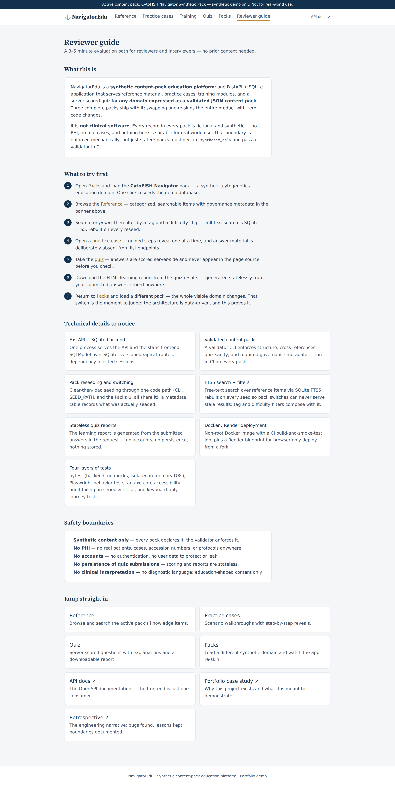
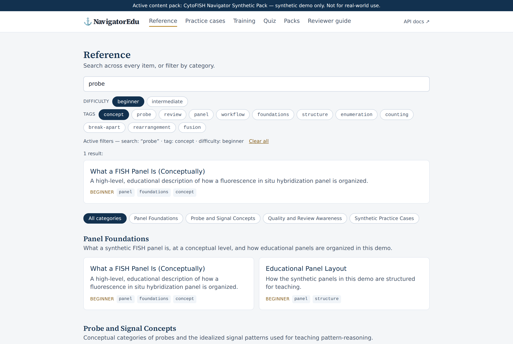

# NavigatorEdu — Reviewer Guide

*This is the in-app **Reviewer guide** (`#/guide` in the top navigation),
mirrored for anyone browsing the repository on GitHub without running the
app. Same content, same order — the app version adds one-click jumps into
every section. A 3–5 minute evaluation path; no prior context needed.*

## What this is

NavigatorEdu is a **synthetic content-pack education platform**: one
FastAPI + SQLite application that serves reference material, practice
cases, training modules, and a server-scored quiz for **any domain
expressed as a validated JSON content pack**. Three complete packs ship
with it; swapping one re-skins the entire product with zero code changes.

It is **not clinical software**. Every record in every pack is fictional
and synthetic — no PHI, no real cases, and nothing here is suitable for
real-world use. That boundary is enforced mechanically, not just stated:
packs must declare `synthetic_only` and pass a validator in CI.

## What to try first

Run the app first (`README.md` → "Run it locally" — under a minute), then:

1. Open **Packs** and load the **CytoFISH Navigator** pack — a synthetic
   cytogenetics education domain. One click reseeds the demo database.
2. Browse the **Reference** — categorized, searchable items with governance
   metadata in the banner above.
3. Search for *probe*, then filter by a tag and a difficulty chip —
   full-text search is SQLite FTS5, rebuilt on every reseed.

   

4. Open a **practice case** — guided steps reveal one at a time, and answer
   material is deliberately absent from list endpoints.
5. Take the **quiz** — answers are scored server-side and never appear in
   the page source before you check.
6. **Download the HTML learning report** from the quiz results — generated
   statelessly from your submitted answers, stored nowhere.
7. Return to **Packs** and load a different pack — the whole visible domain
   changes. That switch is the moment to judge: the architecture is
   data-driven, and this proves it.

## Technical details to notice

- **FastAPI + SQLite backend** — one process serves the API and the static
  frontend; SQLModel over SQLite, versioned `/api/v1` routes,
  dependency-injected sessions.
- **Validated content packs** — a validator CLI enforces structure,
  cross-references, quiz sanity, and required governance metadata — run in
  CI on every push.
- **Pack reseeding and switching** — clear-then-load seeding through one
  code path (CLI, `SEED_PATH`, and the Packs UI all share it); a metadata
  table records what was actually seeded.
- **FTS5 search + filters** — free-text search over reference items via
  SQLite FTS5, rebuilt on every seed so pack switches can never serve stale
  results; tag and difficulty filters compose with it.
- **Stateless quiz reports** — the learning report is generated from the
  submitted answers in the request — no accounts, no persistence, nothing
  stored.
- **Docker / Render deployment** — non-root Docker image with a CI
  build-and-smoke-test job, plus a Render blueprint for browser-only deploy
  from a fork.
- **Four layers of tests** — pytest (backend, no mocks, isolated in-memory
  DBs), Playwright behavior tests, an axe-core accessibility audit failing
  on serious/critical, and keyboard-only journey tests.

## Safety boundaries

- **Synthetic content only** — every pack declares it, the validator
  enforces it.
- **No PHI** — no real patients, cases, accession numbers, or protocols
  anywhere.
- **No accounts** — no authentication, no user data to protect or leak.
- **No persistence of quiz submissions** — scoring and reports are
  stateless.
- **No clinical interpretation** — no diagnostic language; education-shaped
  content only.

## Jump straight in

Running the app: **Reference**, **Practice cases**, **Quiz**, **Packs**,
and the **API docs** (`/docs`) are all one click from the top navigation.

Reading on GitHub:

- [Portfolio case study](PORTFOLIO_CASE_STUDY.md) — why this project exists
  and what it is meant to demonstrate.
- [Retrospective](RETROSPECTIVE.md) — the engineering narrative: bugs
  found, lessons kept, boundaries documented.
- [Architecture](ARCHITECTURE.md) — system design, data flow, and
  trade-offs.
- [Demo guide](DEMO_GUIDE.md) — 2-minute and 5-minute presenter paths.
